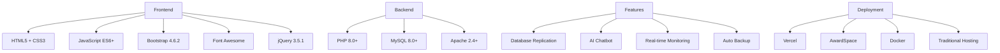

# 🏥 FisioCare - Modern Physiotherapy Booking System

[](https://php.net)
[](https://mysql.com)
[](https://developer.mozilla.org/en-US/docs/Web/JavaScript)
[](https://getbootstrap.com)
[](https://html.spec.whatwg.org/)
[](https://www.w3.org/Style/CSS/)
[](LICENSE)

> **🚀 Sistem booking fisioterapi modern dengan teknologi database replication, chatbot AI, dan monitoring real-time untuk layanan kesehatan yang optimal.**

## 🌟 **Demo Live**

[**🔗 Live Demo**](https://booking-fisioterapi.vercel.app) | [**📱 Mobile Demo**](https://booking-fisioterapi.vercel.app/pages/index.php) | [**👨‍💼 Admin Panel**](https://booking-fisioterapi.vercel.app/pages/admin.php)

## 📋 **Daftar Isi**

- [✨ Fitur Utama](#-fitur-utama)
- [🎯 Preview](#-preview)
- [🚀 Quick Start](#-quick-start)
- [📦 Instalasi](#-instalasi)
- [🔧 Teknologi](#-teknologi)
- [🏗️ Arsitektur](#️-arsitektur)
- [💻 Penggunaan](#-penggunaan)
- [🔒 Keamanan](#-keamanan)
- [🔄 Database Replication](#-database-replication)
- [🤖 AI Chatbot](#-ai-chatbot)
- [📊 Monitoring](#-monitoring)
- [🌐 Deployment](#-deployment)
- [🧪 Testing](#-testing)
- [🤝 Contributing](#-contributing)
- [📄 License](#-license)

## ✨ **Fitur Utama**

### 🏥 **Healthcare Management**
- **📅 Smart Booking System**: Sistem booking dengan validasi waktu dan konflik
- **👥 User Management**: Registrasi, login, dan manajemen profil user
- **🏠 Home Service**: Layanan fisioterapi di rumah atau klinik
- **📋 Medical Records**: Riwayat treatment dan progress tracking
- **💊 Treatment Plans**: Perencanaan terapi yang personalized

### 🛡️ **Enterprise Features**
- **🔄 Database Replication**: Real-time master-slave replication
- **📊 Health Monitoring**: Sistem monitoring kesehatan database
- **🔒 Security System**: Advanced authentication dan authorization
- **💾 Auto Backup**: Backup otomatis dengan kompresi dan rotasi
- **⚡ Load Balancing**: Distribusi beban query untuk performa optimal

### 🤖 **AI & Automation**
- **🤖 AI Chatbot**: Asisten virtual untuk bantuan customer
- **🔔 Smart Notifications**: Notifikasi otomatis untuk appointment
- **📈 Analytics**: Dashboard analytics untuk insights
- **🎯 Recommendation Engine**: Rekomendasi treatment berdasarkan kondisi

### 🎨 **Modern UI/UX**
- **📱 Responsive Design**: Optimal untuk semua device
- **🌈 Modern Interface**: Clean dan intuitive design
- **⚡ Fast Loading**: Optimized untuk kecepatan
- **🎭 Interactive Elements**: Smooth animations dan micro-interactions

## 🎯 **Preview**

### 🖥️ **Desktop Dashboard**

| User Dashboard | Admin Panel |
|:--------------:|:-----------:|
|  |  |

### 📱 **Mobile Experience**

<div align="center">
  
  
</div>

### 🤖 **AI Chatbot Interface**

<div align="center">
  
</div>

## 🚀 **Quick Start**

### ⚡ **Instalasi Cepat (5 menit)**

```bash
# 1. Clone repository
git clone https://github.com/whympxx/BookingFisioterapi.git
cd BookingFisioterapi

# 2. Setup database
mysql -u root -p
CREATE DATABASE db_fisioterapi;
USE db_fisioterapi;
source database/schema.sql;

# 3. Konfigurasi database
cp includes/db.php.example includes/db.php
# Edit includes/db.php dengan kredensial database Anda

# 4. Jalankan dengan PHP server
php -S localhost:8000

# 5. Akses aplikasi
# http://localhost:8000/pages/index.php
```

### 🐳 **Docker Quick Start**

```bash
# Clone dan jalankan dengan Docker
git clone https://github.com/whympxx/BookingFisioterapi.git
cd BookingFisioterapi

# Build dan run containers
docker-compose up -d

# Akses aplikasi
# http://localhost:8080
```

## 📦 **Instalasi**

### 📋 **System Requirements**

| Component | Minimum | Recommended |
|-----------|:-------:|:-----------:|
| PHP | 7.4+ | 8.0+ |
| MySQL | 5.7+ | 8.0+ |
| Apache | 2.4+ | 2.4+ |
| Memory | 512MB | 1GB+ |
| Storage | 1GB | 5GB+ |

### 🔧 **Instalasi Detail**

#### **Method 1: XAMPP/WAMP (Recommended)**

1. **Download XAMPP**
   ```bash
   # Download dari https://www.apachefriends.org/
   # Install dan start Apache + MySQL
   ```

2. **Clone Project**
   ```bash
   cd C:\xampp\htdocs
   git clone https://github.com/whympxx/BookingFisioterapi.git
   ```

3. **Setup Database**
   ```sql
   -- Buka phpMyAdmin (localhost/phpmyadmin)
   CREATE DATABASE db_fisioterapi CHARACTER SET utf8mb4 COLLATE utf8mb4_unicode_ci;
   -- Import database/schema.sql
   ```

4. **Konfigurasi**
   ```php
   // Edit includes/db.php
   $host = "localhost";
   $user = "root";
   $password = "";
   $database = "db_fisioterapi";
   ```

#### **Method 2: Linux Server**

```bash
# Install dependencies
sudo apt update
sudo apt install apache2 mysql-server php php-mysql

# Clone project
cd /var/www/html
sudo git clone https://github.com/whympxx/BookingFisioterapi.git
sudo chown -R www-data:www-data BookingFisioterapi

# Setup database
sudo mysql -u root -p
CREATE DATABASE db_fisioterapi;
CREATE USER 'fisio_user'@'localhost' IDENTIFIED BY 'secure_password';
GRANT ALL PRIVILEGES ON db_fisioterapi.* TO 'fisio_user'@'localhost';
FLUSH PRIVILEGES;
```

## 🔧 **Teknologi**

### 🏗️ **Tech Stack**



### 📚 **Dependencies**

```json
{
  "frontend": {
    "bootstrap": "4.6.2",
    "jquery": "3.5.1",
    "font-awesome": "6.4.0",
    "google-fonts": "Inter, Montserrat"
  },
  "backend": {
    "php": ">=7.4",
    "mysql": ">=5.7",
    "apache": ">=2.4"
  },
  "features": {
    "database-replication": "trigger-based",
    "chatbot": "rule-based-ai",
    "monitoring": "real-time",
    "backup": "automated"
  }
}
```

## 🏗️ **Arsitektur**

### 🔄 **Database Replication Architecture**

```
┌─────────────────┐    ┌─────────────────┐
│   Master DB     │────│   Slave DB      │
│  (Write/Read)   │    │  (Read Only)    │
└─────────────────┘    └─────────────────┘
         │                        │
         ▼                        ▼
┌─────────────────┐    ┌─────────────────┐
│  Trigger-based  │    │  Load Balancer  │
│   Replication   │    │   (Read Ops)    │
└─────────────────┘    └─────────────────┘
```

### 🏢 **Application Architecture**

```
┌─────────────────┐
│   Frontend      │
│  (HTML/CSS/JS)  │
└─────────────────┘
         │
         ▼
┌─────────────────┐
│   PHP Backend  │
│  (Business      │
│   Logic)        │
└─────────────────┘
         │
         ▼
┌─────────────────┐
│   Database      │
│  (MySQL with    │
│   Replication)  │
└─────────────────┘
```

## 💻 **Penggunaan**

### 👨‍💼 **Admin Panel**

1. **Login Admin**
   ```
   URL: /pages/admin.php
   Default: admin/admin123
   ```

2. **Dashboard Features**
   - 📊 Analytics overview
   - 👥 User management
   - 📅 Booking management
   - 🔄 Replication monitoring
   - 💾 Backup management

### 👤 **User Interface**

1. **Registrasi**
   ```
   URL: /pages/register.php
   Fields: Username, Email, Password, Phone
   ```

2. **Booking Process**
   ```
   1. Login → Dashboard
   2. Pilih layanan fisioterapi
   3. Pilih tanggal dan waktu
   4. Isi form booking
   5. Konfirmasi booking
   ```

3. **Available Services**
   - 🦵 Terapi Lutut
   - 🏃‍♂️ Rehabilitasi Pasca Cedera
   - 💆‍♂️ Pijat Medis
   - 🔄 Terapi Tulang Belakang
   - 🧠 Terapi Stroke
   - 👶 Terapi Anak

### 🤖 **AI Chatbot**

1. **Activation**
   - Click chatbot icon (bottom right)
   - Available 24/7 for assistance

2. **Capabilities**
   - 📋 Booking assistance
   - ❓ FAQ responses
   - 🏥 Service information
   - 📞 Contact support

## 🔒 **Keamanan**

### 🛡️ **Security Features**

- **🔐 Authentication**: Secure login with password hashing
- **🔑 Authorization**: Role-based access control
- **🛡️ SQL Injection Prevention**: Prepared statements
- **🚫 XSS Protection**: Input sanitization
- **🔒 CSRF Protection**: Token-based validation
- **📝 Activity Logging**: Comprehensive audit trail

### 🔐 **Security Best Practices**

```php
// Password hashing
$hashedPassword = password_hash($password, PASSWORD_DEFAULT);

// Prepared statements
$stmt = $conn->prepare("SELECT * FROM users WHERE email = ?");
$stmt->bind_param("s", $email);

// Input sanitization
$input = htmlspecialchars(trim($_POST['input']), ENT_QUOTES, 'UTF-8');
```

## 🔄 **Database Replication**

### ⚡ **Real-time Replication**

- **Trigger-based**: Automatic data synchronization
- **Master-Slave**: Write to master, read from slave
- **Failover**: Automatic failover on master failure
- **Load Balancing**: Distribute read queries

### 📊 **Monitoring Dashboard**

```bash
# Access monitoring
http://localhost/BookingFisioterapi/scripts/replication_monitor_enhanced.php

# Features:
# - Real-time sync status
# - Replication lag monitoring
# - Error detection
# - Performance metrics
```

### 🔧 **Setup Replication**

```bash
# Auto setup script
cd scripts
./setup_replication.bat

# Manual setup
mysql -u root -p < scripts/setup_simple_replication.sql
```

## 🤖 **AI Chatbot**

### 🧠 **Intelligence Features**

- **Natural Language Processing**: Understand user queries
- **Context Awareness**: Remember conversation context
- **Smart Routing**: Route complex queries to human support
- **Learning System**: Improve responses over time

### 💬 **Conversation Flow**

```
User: "I want to book physiotherapy"
Bot: "I can help you with that! What type of therapy do you need?"
User: "Knee therapy"
Bot: "Great! When would you like to schedule your appointment?"
```

## 📊 **Monitoring**

### 📈 **Real-time Analytics**

- **📊 Booking Statistics**: Daily, weekly, monthly reports
- **👥 User Analytics**: Registration and activity trends
- **🔄 System Health**: Database and server monitoring
- **⚡ Performance Metrics**: Response times and throughput

### 🚨 **Alert System**

- **🔴 Critical Alerts**: System failures
- **🟡 Warning Alerts**: Performance degradation
- **🟢 Info Alerts**: Successful operations
- **📧 Email Notifications**: Automated alerts

## 🌐 **Deployment**

### ☁️ **Cloud Deployment**

#### **Vercel (Recommended)**

```bash
# Install Vercel CLI
npm i -g vercel

# Deploy
vercel --prod

# Environment variables
vercel env add DB_HOST
vercel env add DB_USER
vercel env add DB_PASSWORD
vercel env add DB_NAME
```

#### **Docker Deployment**

```yaml
# docker-compose.yml
version: '3.8'
services:
  app:
    build: .
    ports:
      - "8080:80"
    depends_on:
      - mysql
  mysql:
    image: mysql:8.0
    environment:
      MYSQL_ROOT_PASSWORD: root
      MYSQL_DATABASE: db_fisioterapi
```

### 🖥️ **Traditional Hosting**

- **📋 Guide**: See [DEPLOYMENT_GUIDE.md](DEPLOYMENT_GUIDE.md)
- **🌐 AwardSpace**: Free hosting option
- **💰 Paid Hosting**: Recommended for production

## 🧪 **Testing**

### 🔍 **Test Categories**

#### **Unit Tests**
```bash
# Test database connection
php test/test_db_connection.php

# Test replication
php test/test_replication_class.php
```

#### **Integration Tests**
```bash
# Test full booking flow
php test/test_booking_flow.php

# Test user registration
php test/test_user_registration.php
```

#### **Performance Tests**
```bash
# Load testing
php test/test_performance.php

# Database stress test
php test/test_db_load.php
```

### 🔧 **Test Commands**

```bash
# Run all tests
php test/run_all_tests.php

# Test specific feature
php test/test_booking.php

# Test replication
scripts/test_real_replication.bat
```

## 🤝 **Contributing**

### 🚀 **How to Contribute**

1. **Fork** the repository
2. **Create** feature branch (`git checkout -b feature/AmazingFeature`)
3. **Commit** changes (`git commit -m 'Add AmazingFeature'`)
4. **Push** to branch (`git push origin feature/AmazingFeature`)
5. **Open** Pull Request

### 📝 **Contribution Guidelines**

- **🐛 Bug Reports**: Use issue template
- **💡 Feature Requests**: Describe use case
- **🔧 Code**: Follow PSR-12 standards
- **📚 Documentation**: Update relevant docs
- **🧪 Testing**: Add tests for new features

### 🏆 **Contributors**

<div align="center">

| Avatar | Name | Role | Contributions |
|:------:|:----:|:----:|:-------------:|
|  | **whympxx** | Creator & Lead Developer | 💻 📖 🎨 🔧 |

</div>

## 📄 **License**

This project is licensed under the **MIT License** - see the [LICENSE](LICENSE) file for details.

### 📜 **License Summary**

- ✅ **Commercial Use**: Allowed
- ✅ **Modification**: Allowed
- ✅ **Distribution**: Allowed
- ✅ **Private Use**: Allowed
- ❌ **Liability**: Not provided
- ❌ **Warranty**: Not provided

---

<div align="center">

### 🚀 **Ready to Transform Healthcare?**

[**⬇️ Download Now**](https://github.com/whympxx/BookingFisioterapi/archive/refs/heads/main.zip) | [**🌟 Give it a Star**](https://github.com/whympxx/BookingFisioterapi/stargazers) | [**🐛 Report Bug**](https://github.com/whympxx/BookingFisioterapi/issues) | [**💡 Request Feature**](https://github.com/whympxx/BookingFisioterapi/issues/new)

**Built with ❤️ for healthcare by [whympxx](https://github.com/whympxx)**

*"Revolutionizing physiotherapy booking with modern technology"*


</div>
